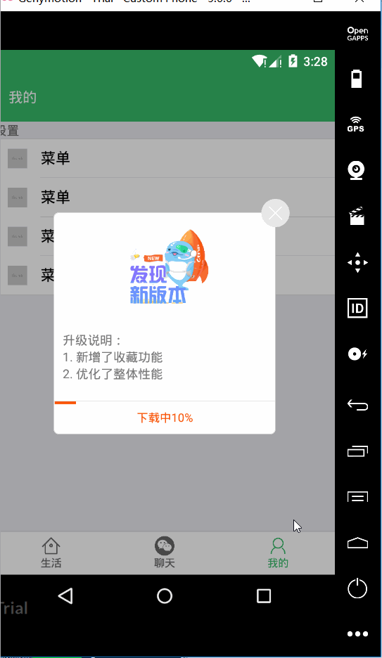

# react-native-update-app

全自动 app 硬更新组件，简单易用。

## 例子


## 预览



## 功能

- Android点击升级按钮全自动升级安装apk，本地已下载了apk不会重新下载
- IOS点击升级按钮进入苹果商店下载
- 支持多主题(正在开发中...)，及自定义主题

## 安装

因为该库依赖`react-native-fs`，所以首先需要安装它。具体点击查看[react-native-fs](https://github.com/itinance/react-native-fs)。

### 安装npm

```
npm install react-native-update-app --save
```

### 自动链接

```
react-native link react-native-update-app
```

成功后，命令行窗口会有 `success` 字样提示。但是这里有个坑，有时它不会自动往`android/app/build.gradle`里加入下面这句，需要手动加上。

```
dependencies {
    ...
    compile project(':react-native-update-app')  // 添加这句
}
```

当然如果你的代码里已经有上面一句了，就不需要添加了。

### 手动链接

如果自动成功，则忽略这一步。如果自动链接不行，请安装下面步骤进行手动链接。

#### iOS

1.  In XCode, in the project navigator, right click `Libraries` ➜ `Add Files to [your project's name]`
2.  Go to `node_modules` ➜ `react-native-update-app` and add `RNUpdateApp.xcodeproj`
3.  In XCode, in the project navigator, select your project. Add `libRNUpdateApp.a` to your project's `Build Phases` ➜ `Link Binary With Libraries`
4.  Run your project (`Cmd+R`)<

#### Android

1.  打开 `android/app/src/main/java/[...]/MainActivity.java`

*   添加 `import com.reactlibrary.RNUpdateAppPackage;`
*   在 `getPackages()`方法里添加 `new RNUpdateAppPackage()` 

2.  在 `android/settings.gradle` 加入:

```
include ':react-native-update-app'
project(':react-native-update-app').projectDir = new File(rootProject.projectDir, 	'../node_modules/react-native-update-app/android')
```

3.  在 `android/app/build.gradle` 里加入:

```
dependencies {
    ...
    compile project(':react-native-update-app')
}
```

## 注意

在主程序`android/app/src/main/AndroidManifest.xml`里增加下面代码。

```
<application ..>
...
        // 增加下面代码
    <provider
            android:name="android.support.v4.content.FileProvider"
            android:authorities="${applicationId}.fileprovider"
            android:grantUriPermissions="true"
            tools:replace="android:authorities"
            android:exported="false">
        <meta-data
                android:name="android.support.FILE_PROVIDER_PATHS"
                tools:replace="android:resource"
                android:resource="@xml/provider_paths"/>
    </provider>
</application>
```

## 使用

全自动检查版本进行更新升级，只需在app的入口文件中引入组件即可。

```javascript
import RNUpdate from "react-native-update-app"

class App extends Component{
    // url 表示接口地址，在下面有详细介绍
    onBeforeStart = async ()=>{
        // 在这里可以发请求，用promise返回结果
        let res = await toolApi.updateApp() 
        return res.data
        /*返回结果 res 如下
        {
            "data": {
                "version":"1.1",
                "filename":"微信.apk",
                "url":"http://gdown.baidu.com/data/wisegame/785f37df5d72c409/weixin_1320.apk",
                "desc":["更新了一些bug", "修复了一些UI问题"]
            },
            "error":{"code":0}
        }*/
    }

    render() {
        return (
            <View>
                <RNUpdate
                    onBeforeStart={this.onBeforeStart}
                    progressBarColor="#f50"
                    updateBoxWidth={250},      // 选填，升级框的宽度
                    updateBoxHeight={250}      // 选填，升级框的高度
                    updateBtnHeight={38}       // 选填，升级按钮的高度
                    bannerImage={require('./imgs/a.png')}  // 选填，换升级弹框图片
                />
            </View>
        )
    }
}
```

onBeforeStart函数返回一个RNUpdate组件的配置对象。格式如上代码所示。

*   `version`: app 版本号(`android/app/build.gradle`里`versionName`字段)，，如果大于当前版本号，则会弹出更新框
*   `url` : 如果是android，返回 android apk 下载地址，如果是ios，返回 ios应用商店的对应 url。(根据上面的platform字段区分)
*   `fileName`: apk 文件名
*   `desc`: 更新说明

如果需要在其他地方调用，可以使用下面代码。

```javascript
<RNUpdate ref={r=>global.$RNUpdate = r} />

async ()=>{
    let res = await toolApi.updateApp() 
    $RNUpdate.updateApp(res.data)
}
```

## 注意事项

1. `react-native-fs`获取文件大小时，是根据请求头的`Content-Length`获取的。如果获取错误，则需要后端修改。